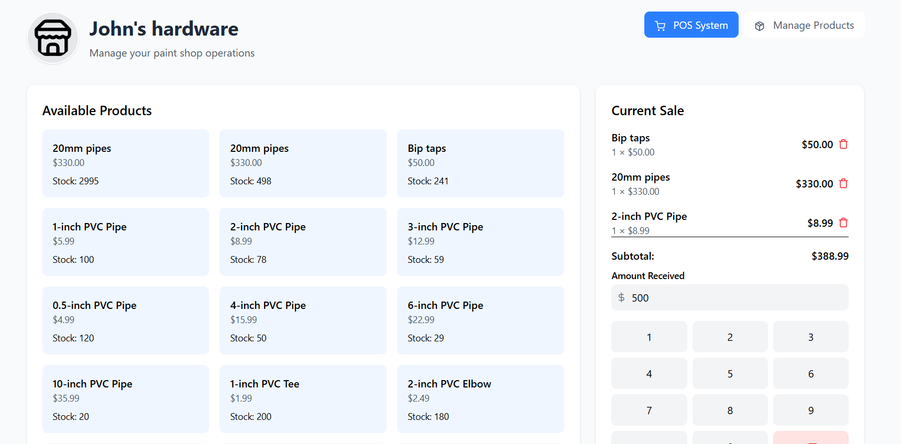

# 🛒 POS System for Sales and Inventory Management

## 📌 Overview

This project is a **Point of Sale (POS) system** designed for efficient sales transactions and inventory management. It includes a **React-based frontend** and a **Spring Boot backend**, ensuring a seamless user experience.

## Demo

  

## 🛠️ Tech Stack

### **Frontend**
- 🚀 **React** (Vite)
- 🎨 **Tailwind CSS**
- 🔀 **React Router**
- 🔍 **React Query**

### **Backend**
- ☕ **Spring Boot**
- 🌐 **RESTful APIs**
- 📦 **MySQL** (Database)

## ✨ Features

✔️ Sales transaction management  
✔️ Inventory tracking and management  
✔️ User authentication & authorization  
✔️ Modern & responsive UI  
✔️ API-driven data handling  

## 🚀 Installation & Setup

### **Prerequisites**
- **Node.js** & **npm/yarn** installed
- **Java 17+** installed for the backend
- **Spring Boot & Maven** for backend
- **MySQL / PostgreSQL** database configured

### **Frontend Setup**
```sh
# Clone the repository

git clone https://github.com/charithabimsara/POS-System-for-Sales-and-Inventory-Management.git

# Navigate to the project directory

cd POS-System-for-Sales-and-Inventory-Management

# Install dependencies

npm install

# Start the development server

npm run dev
```

### **Backend Setup**

#### Navigate to the backend directory

```
cd backend-APIs
```

#### Build and run the Spring Boot application

```
mvn spring-boot:run
```

## 📜 License

This project is MIT Licensed. Feel free to use and modify it.

